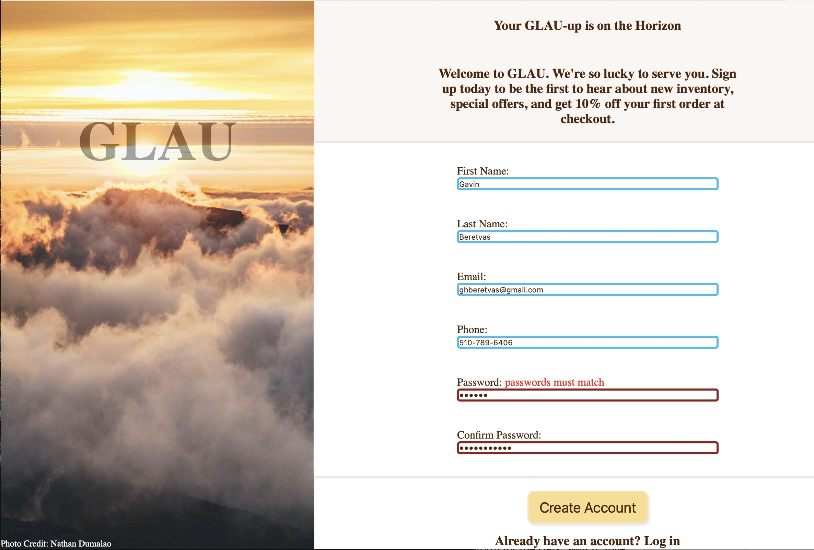

## Form Validation: GLAU

[Try it out for yourself!](https://gavinberetvas.github.io/glau-form-TOP/)   :point_left:

## Summary

This is a sample conversion page I drafted to practice HTML form validation. 

There is a bit of simple javascript to highlight satisfactorily completed form elements in blue. The JS also highlights passwords that do not match in red. 

The rest is pure HTML. The create account button just runs a test form validation. It does not connect anywhere. Nevertheless, if you test out this form, I recommend exercising good security pracices. 

**Do not enter your personal information.**

### Technologies

* HTML5
* CSS3
* Vanilla JS/ES6

### Supporting Tools

* ESLint
* Git/GitHub
* Visual Studio Code

## Credits
* Thanks to [Nate Dumlao](https://unsplash.com/@nate_dumlao) for taking the beautiful photo.

## License

* Copyright © 2023 Gavin Beretvas
